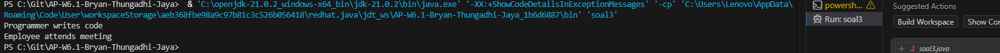

1. output no. 1 ()
    alasan output yang muncul adalah "meow", karena pada subclassnya terdapat override yang dimana dia menimpa output utamanya yaitu "some animal sound"

2. output no. 2 
    alasan outputnya itu "vehicle is moving" dan "car is moving", karena terdapat v1.move(); dan v2.move(); yang dimana dia akan memanggil kedua output yang berada di classnya 

3. output no.3  
    alasan outputnya kenapa yang muncul itu "programmer writes code" dan "employee attends meeting" adalah karena variabel work yang terpanggil itu yang memiliki override di classnya yang outputnya "programmer writes code", dan variabel yang dipanggil adalah variabel attend meeting maka output "employee attends meeting"